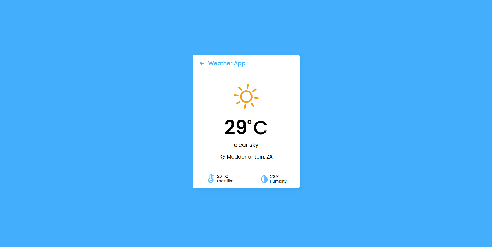

# Weather App

> Search a city or allow the app to access your your location and display the weather conditions.

## Built With

- Html5
- CSS3
- Javascript

# live demo
Soon

## Getting Started

To get a local copy up and running follow these simple example steps:

- [Copy this link](https://github.com/tmampa/to-do-list.git)
- Open your terminal or command line
- Run `git clone` and Paste the link
- Open the folder with your code editor

### Prerequisites
- Basic knowledge of javascript

## Authors

👤 **Tshephang Mampa**

- GitHub: [@tmampa](https://github.com/tmampa)
- Twitter: [@tshephangm_](https://twitter.com/tshephangm_)
- LinkedIn: [Tshephang Mampa](https://linkedin.com/in/tshephangmampa)

## 🤝 Contributing

Contributions, issues, and feature requests are welcome!

Feel free to check the [issues page](https://github.com/tmampa/to-do-list/issues).

## Show your support

Give a ⭐️ if you like this project!

## Acknowledgments

- Hat tip to anyone whose code was used
- Inspiration
- etc

## 📝 License

This project is [MIT](./MIT.md) licensed.